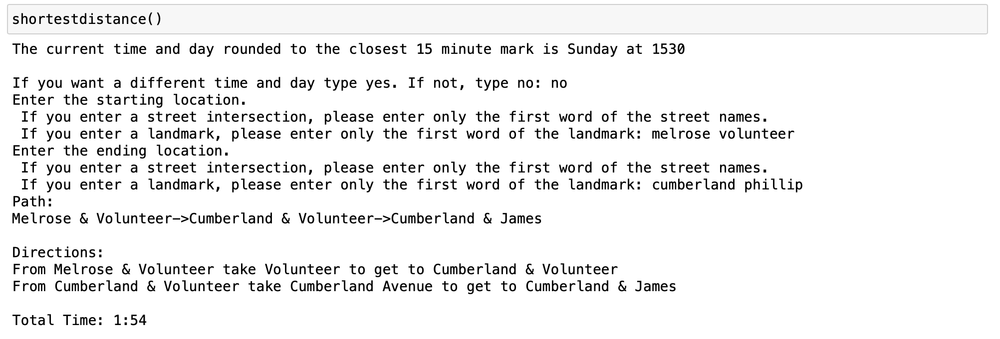
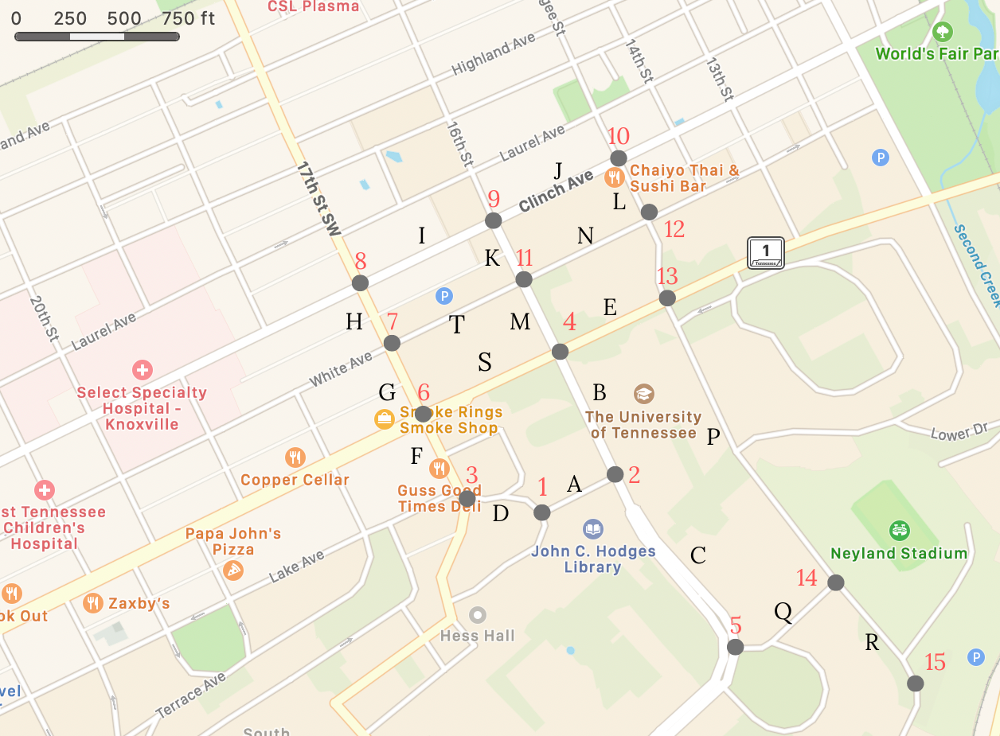

# Modeling Traffic Conditions to Determine the Shortest Path

## Project Description 

In a sentence, we analyzed traffic conditions around Knoxville, Tennessee and used this data to predict travel paths. This project has three parts. 
1. The first part is the collection of traffic data through Google Maps. This data is in the trafficconditions folder. 
1. The second part is the use of this data to wrtie an algorithm that determines the shortest path from one location to another. 
1. The third part was to create a user interface that allows user input for the locations, day, and time.

### What's in the Repository
- screenshots folder contains images that are in this readme file (examples of function output)
- trafficFiles folder is necessary to run the program. The files that are created by the program will be stored here to be analyzed by the pathfinder program. 
- trafficconditions holds the files containing the traffic data for the mapped area
- DatasetDescription is a more detailed description of the data and our process. 
- the function notebook is the meat of the project. It houses the shortestdistance function that will ask for user input and output the shortest path between two locations. 
- map is a labeled map of our area of study. It has the labeled nodes that we refer to in the Function notebook and the trafficconditions files.
- pathfinder.cpp is the program that will determine the shortest path. We use this program in the function notebook. 
- pathfinder is the binary file compiled from the cpp file. The notebook will use this to run the algorithm.

## How to Install and Run the Project

### If you have a python interpreter installed

1. Download the zip folder by clicking on the green code button and selecting download zip.
2. Extract the folder on your desktop.
3. Open the Function notebook and run shortestdistance.

### If you do not have a python interpreter installed

1. Install an interpreter. (Anaconda or pip).
2. Follow the instructions above.

## How to use the Project
1. Open the function notebook and run shortestdistance. 
2. You will be asked if you want to use the current date and time or enter your own. It will accept yes or no. 

3. If you select yes, then you will be prompted to enter the time and the day you would like to analyze as shown below. 

4. If you select no, then the current time and day will be rounded to the nearest 15 minute interval, as shown below. 

5. Then you will be prompted to enter the starting and ending location you would like to analyze as shown. You can enter landmarks, such as Hodges (library) or Canes (restaurant), or enter intersections. Both examples are shown below. 

6. The fastest path considering traffic conditions at that day and time will be printed, along with the travel time. 

Our labeled map of Knoxville: 

## Team Members

Noah Dahle (zrd939@vols.utk.edu) and Kristina Wilson (kwils119@vols.utk.edu)

Advisor: Dr. Olivia Prosper (oprosper@utk.edu)
