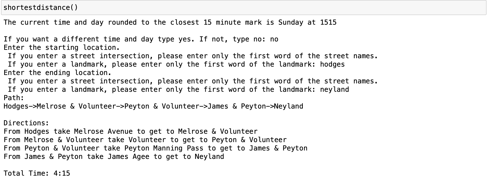

# Modeling Traffic Conditions to Determine the Shortest Path

## Project Description 

In a sentence, we analyzed traffic conditions around Knoxville, Tennessee and used this data to predict travel paths. This project has three parts. 
1. The first part is the collection of traffic data through Google Maps. This data is in the trafficconditions folder. 
1. The second part is the use of this data to wrtie an algorithm that determines the shortest path from one location to another. 
1. The third part was to create a user interface that allows user input for the locations, day, and time.

## How to Install and Run the Project

### If you have a python interpreter installed

1. Download the zip folder by clicking on the green code button and selecting download zip.
2. Extract the folder on your desktop.
3. Open the Function notebook and run shortestdistance.

### If you do not have a python interpreter installed

1. Install an interpreter. (Anaconda or pip).
2. Follow the instructions above.

## How to use the Project
1. Open the function notebook and run shortestdistance. 
2. You will be asked if you want to use the current date and time or enter your own. Enter yes 

